# 🚀 DevOps Environment Setup Project

## Overview


The project is designed to simulate the responsibilities of a DevOps or
system administrator by creating a lightweight server environment and
configuring it step by step. It highlights how to maintain system
visibility through monitoring tools, strengthen security with proper
user management, and improve reliability by scheduling regular backups
of important web server configuration and content.

Overall, this setup serves as a hands-on demonstration of essential
DevOps practices that support system stability, operational efficiency,
and disaster recovery readiness.
 

------------------------------------------------------------------------

## Environment Setup

``` bash
docker run -it --name devops-assignment ubuntu:latest bash
```

Runs a fresh Ubuntu container to simulate a server environment.

``` bash
apt update && apt upgrade -y
```

Updates package lists and installs the latest system updates.

``` bash
apt install sudo nano wget curl cron tar htop -y
```

Installs essential tools required for system operations, monitoring, and
automation.

------------------------------------------------------------------------

## System Monitoring

``` bash
htop
```

Displays real-time CPU, memory, and process usage in an interactive
interface.
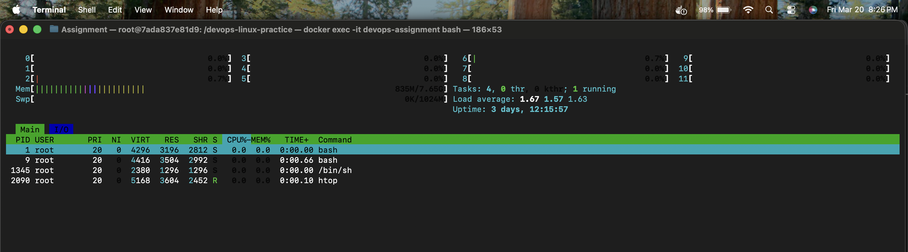

``` bash
df -h
```

Shows disk usage across all mounted file systems in a human-readable
format.

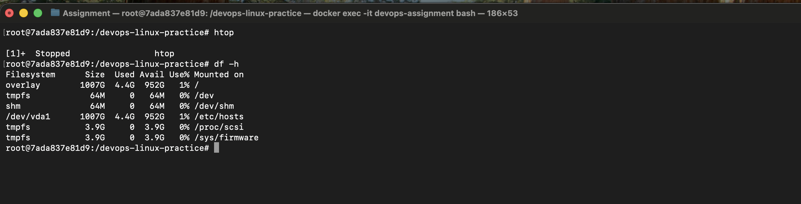

``` bash
du -sh /*
```

Calculates and displays disk usage of top-level directories.

``` bash
top
```

Provides a live view of system processes and resource consumption.

``` bash
mkdir /monitoring_logs
```

Creates a directory to store monitoring logs.

``` bash
top -b -n1 > /monitoring_logs/system_usage.log
df -h >> /monitoring_logs/system_usage.log
du -sh /* >> /monitoring_logs/system_usage.log
```

Captures system metrics and stores them in a log file for analysis.

``` bash
cat /monitoring_logs/system_usage.log
```

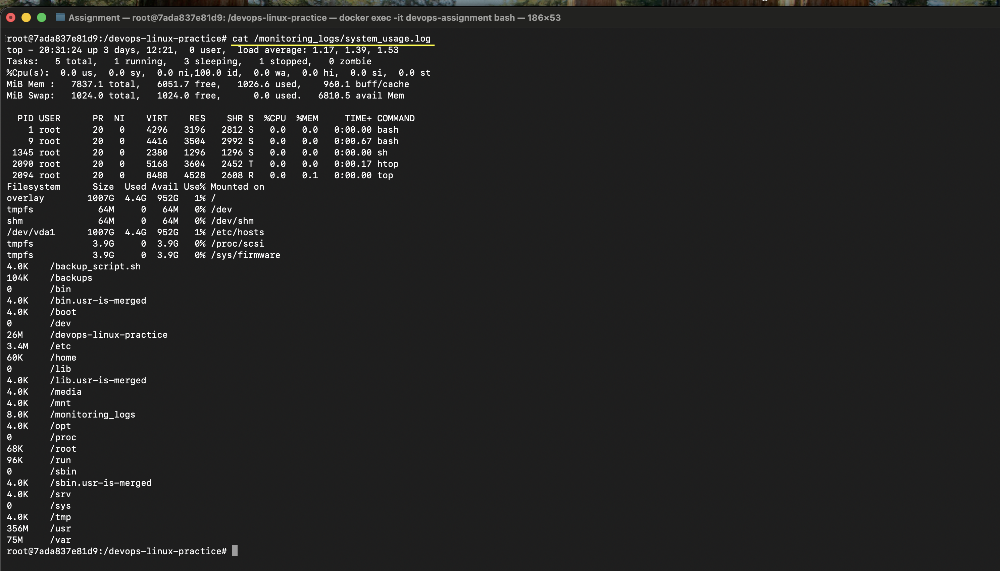

------------------------------------------------------------------------

## User Management

``` bash
useradd -m Sarah
useradd -m mike
```

Creates user accounts along with their home directories.

``` bash
passwd Sarah
passwd mike
```

Assigns secure passwords to each user.

``` bash
mkdir -p /home/Sarah/workspace
mkdir -p /home/mike/workspace
```

Creates isolated working directories for each user.

``` bash
chown -R Sarah:Sarah /home/Sarah
chown -R mike:mike /home/mike
```

Ensures users have ownership of their respective directories.

``` bash
chmod 700 /home/Sarah/workspace
chmod 700 /home/mike/workspace
```

Restricts access so only the owner can read, write, or execute.

```bash
id Sarah
id mike
```

User Management

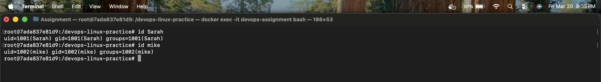

```bash
ls -ld /home/Sarah/workspace
ls -ld /home/mike/workspace
```
User Workspace path

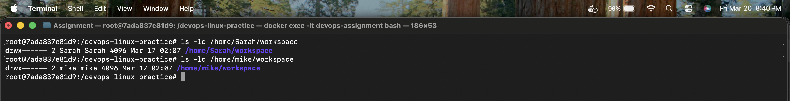

``` bash
chage -M 30 Sarah
chage -M 30 mike
```

Enforces a password expiration policy of 30 days.

``` bash
chage -l Sarah
```
Password Policy


------------------------------------------------------------------------

## Backup Automation

``` bash
apt install apache2 -y
apt install nginx -y
```

Installs Apache and Nginx web servers.

> Note: Apache configuration path differs based on OS. Ubuntu uses `/etc/apache2/` instead of `/etc/httpd/`.

``` bash
mkdir /backups
```

Creates a directory to store backup files.

``` bash
nano /backup_script.sh
```

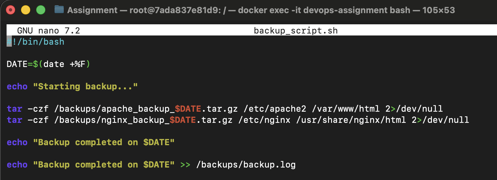

``` bash
#!/bin/bash
DATE=$(date +%F)

echo "Starting backup..."

tar -czf /backups/apache_backup_$DATE.tar.gz /etc/apache2 /var/www/html 2>/dev/null
tar -czf /backups/nginx_backup_$DATE.tar.gz /etc/nginx /usr/share/nginx/html 2>/dev/null
`
echo "Backup completed on $DATE"
echo "Backup completed on $DATE" >> /backups/backup.log
```

Creates a script that compresses configuration and web files, storing
them with date-based naming.

``` bash
chmod +x /backup_script.sh
```

Grants execution permission to the backup script.

``` bash
crontab -e
```

``` bash
0 0 * * 2 /backup_script.sh
```

Schedules the backup to run automatically every Tuesday at midnight.

``` bash
crontab -l
```
Cron Job

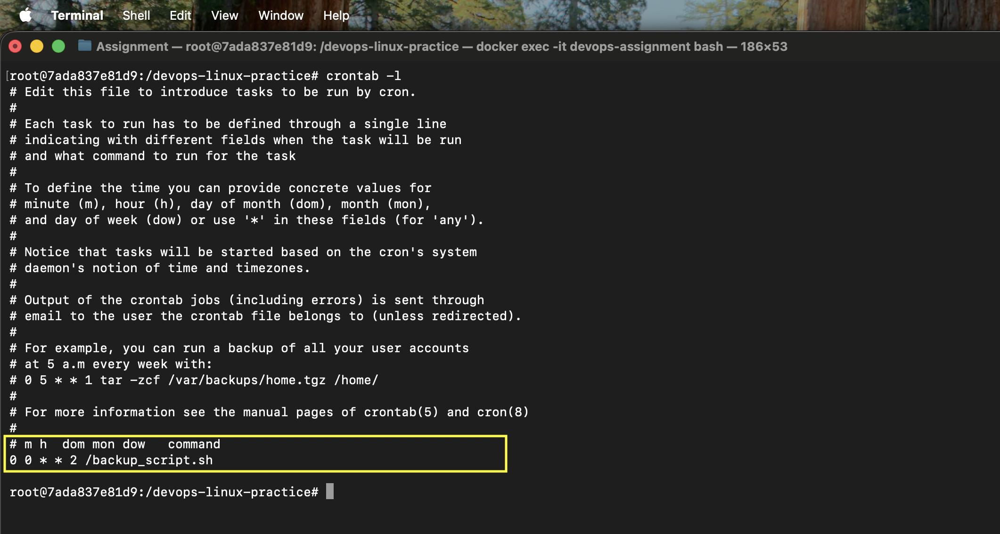

``` bash
cat /backups/backup.log
```
View backup logs 

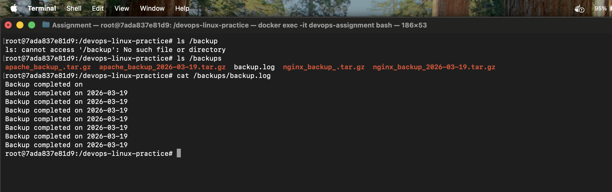

``` bash
bash /backup_script.sh
```

Executes the backup script manually.

``` bash
ls /backups
```

Lists all generated backup files.

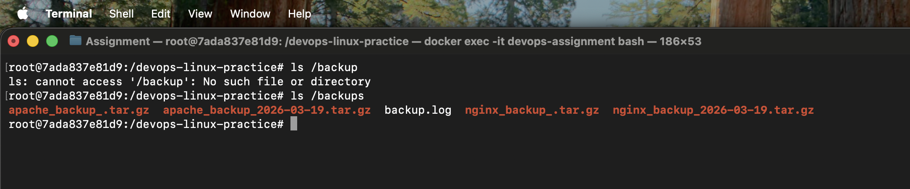


``` bash
tar -tzf /backups/apache_backup_YYYY-MM-DD.tar.gz
tar -tzf /backups/nginx_backup_YYYY-MM-DD.tar.gz
```

Verifies backup integrity by listing archive contents.

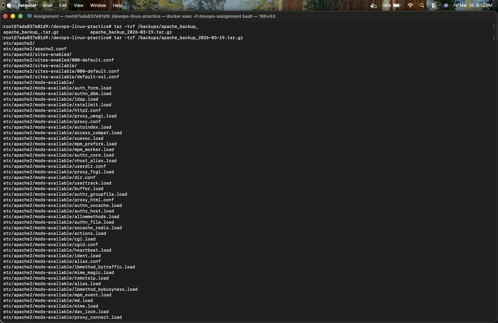

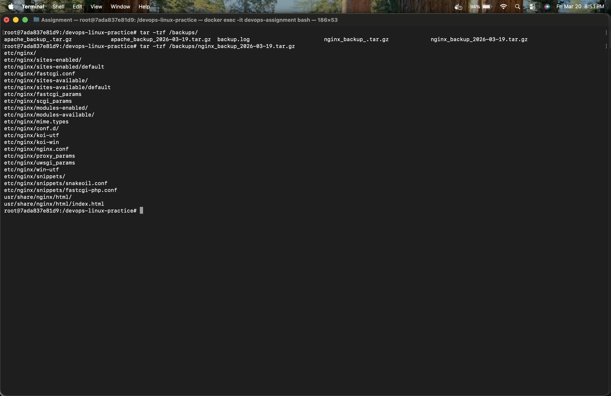


------------------------------------------------------------------------

## Project Structure

    devops-assignment/
    ├── README.md
    ├── backup_script.sh
    ├── monitoring_logs/
    ├── backups/

------------------------------------------------------------------------

## Notes

-   The message `Removing leading '/' from member names` is expected
    behavior from tar and does not indicate an error.
-   Logs are maintained for traceability and validation.

------------------------------------------------------------------------

## ⚠️ Challenges Faced

- Understanding tar warnings (Removing leading '/')
- Fixing date command syntax in backup script
- Ensuring correct file permissions for users
- Debugging cron job execution


## Git Workflow

``` bash
git init
git add .
git commit -m "Initial commit - DevOps setup"
git remote add origin <repo-url>
git push -u origin main
```

------------------------------------------------------------------------

## Outcome

This setup ensures: - Continuous system visibility through monitoring -
Secure and isolated user environments - Reliable automated backups for
disaster recovery

